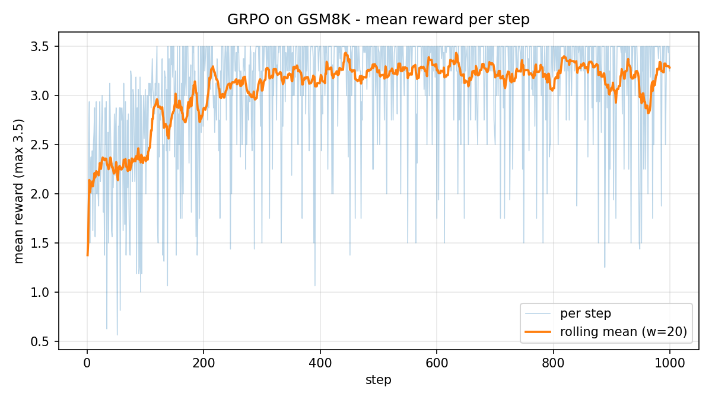
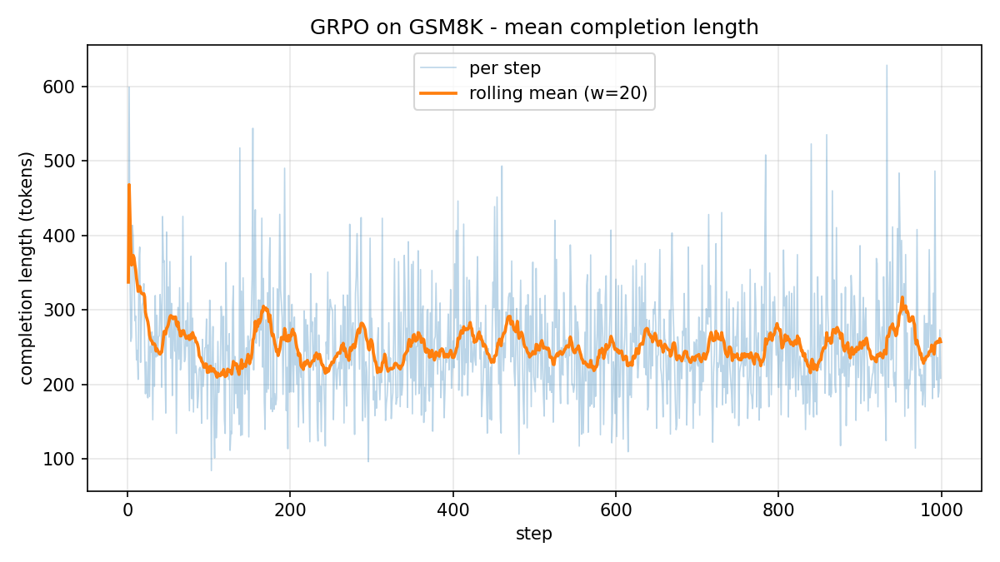

# grpo-rlvr-reasoning

用 **GRPO**(Group Relative Policy Optimization)+ **可驗證獎勵**(RLVR)訓練
`Qwen/Qwen2.5-3B-Instruct` 在 GSM8K 上的數學推理,復刻 DeepSeek-R1 帶起的招牌現象:
**completion 長度隨訓練成長、reward 同步爬升** —— 模型自己學會寫更長、更有效的推理。

- 訓練:Google Colab Pro+(L4 GPU)× [Unsloth](https://unsloth.ai) GRPO × vLLM rollout
- 模型:🤗 [qwen2.5-3b-grpo-gsm8k](https://huggingface.co/kuotunyu/qwen2.5-3b-grpo-gsm8k)(merged 16bit)/
  [qwen2.5-3b-grpo-gsm8k-lora](https://huggingface.co/kuotunyu/qwen2.5-3b-grpo-gsm8k-lora)(LoRA adapter)

## 為什麼是 RLVR

2026 年 RL 訓練 LLM 的主流敘事已經從「訓 reward model 再做 RLHF」轉向
**RLVR(Reinforcement Learning with Verifiable Rewards)**:在數學、程式這類
答案可程式驗證的領域,獎勵直接由規則判分 ——

- **不會被 reward hacking**:答案對就是對,沒有可以討好的神經網路;
- **便宜**:省掉收集偏好資料與訓練 reward model 的整條管線;
- **GRPO 再省一層**:同一題抽 8 個回答、組內比較算相對優勢(advantage),
  連 PPO 的 value model 也不用。

本專案的獎勵組(定義在 [rewards.py](rewards.py),有完整 [pytest](tests/test_rewards.py)):

| 獎勵函數 | 條件 | 分數 |
|---|---|---|
| `correctness_reward` | `<answer>` 內數字 == 標準答案 | **2.0** |
| `strict_format_reward` | 完整 `<reasoning>…</reasoning><answer>…</answer>` 結構 | 0.5 |
| `soft_format_reward` | 兩組 tag 依序出現(部分符合) | 0.5 |
| `number_only_reward` | `<answer>` 區塊是純數字 | 0.5 |

## Aha:長度與 reward 一起爬

> 🖼️ 兩張圖由訓練 notebook 自動產出到 `results/figs/`,正式訓練完成後即出現在此。

| reward 曲線 | completion 長度曲線 |
|---|---|
|  |  |

長度成長不是灌水:格式與答對獎勵不獎勵長度本身,變長是因為**更長的推理更常算對**。

## 評測(GSM8K test 前 200 題,greedy)

完整對照表:[results/eval_report.md](results/eval_report.md)(訓練後由
[eval/run_eval.py](eval/run_eval.py) 產生;base 與訓練後模型的數字都是真實跑出來的)。

訓練**只用 train split(7,473 題)**;test split 在訓練管線中零接觸
(notebook 內有程式級 assert),只在評測時使用 —— 無資料污染。

## 如何執行

### 0. 本機(免 GPU):驗證獎勵函數

```bash
pip install pytest
python -m pytest tests/ -v        # 55 個測試全綠
```

### 1. Colab 訓練

1. 把 [train_grpo_colab.ipynb](train_grpo_colab.ipynb) 上傳 Colab,
   Runtime → Change runtime type → **L4 GPU**。
2. 左側 🔑 Secrets 加 `HF_TOKEN`(Hugging Face **write** token),
   並開啟此 notebook 的存取權(⚠️ 背景執行時無法回應授權彈窗,務必先掛好)。
3. **SMOKE_TEST 跑通**:保持 `SMOKE_TEST = True` → Run all(約 15–20 分鐘),
   確認安裝、模型載入、Drive checkpoint、samples/metrics 記錄、畫圖全鏈路無誤。
4. **正式訓練(背景執行)**:改 `SMOKE_TEST = False` → Run all → 直接關閉分頁。
   Colab Pro+ 會在背景繼續跑(500 步約 4–7 小時);結束時自動 push 兩個 HF repo,
   **伺服器端驗證 push 成功後**自動 `runtime.unassign()` 釋放機器停止扣點。
5. **斷線續跑**:若背景 session 被提早收走,重新連 L4 → 設 `RESUME = True` → Run all,
   會從 Drive 最新有效 checkpoint(每 100 步存一份)接著訓練。

> 📉 **前 ~100 步 reward ≈ 0 是正常現象**(Unsloth 官方文件:等 150–300 步才開始爬),
> 不要提早砍掉健康的 run。

OOM 時的調參階梯(依序嘗試):`GPU_MEMORY_UTILIZATION` 0.85→0.7 →
`NUM_GENERATIONS` 8→6 → `MAX_COMPLETION_LENGTH` 768→512。

### 2. 訓練後評測

```bash
# Colab 或本機 GPU(如 4090)皆可;約 20–40 分鐘
python eval/run_eval.py --trained-model <HF_USERNAME>/qwen2.5-3b-grpo-gsm8k
# 也可以直接評 Drive 上還沒 merge 的 LoRA checkpoint:
python eval/run_eval.py --models trained --adapter /path/to/checkpoint-500
```

產出 `results/eval_report.md` 與逐題生成記錄,commit 回本 repo 即完成。

## 選配:A100 + 7B 旗艦版

L4 + 3B 是成本甜蜜點;想上 7B 只要改 notebook 的 PARAMS cell:

| 參數 | 3B(L4) | 7B(A100 40GB) |
|---|---|---|
| `MODEL_NAME` | Qwen/Qwen2.5-3B-Instruct | `Qwen/Qwen2.5-7B-Instruct` |
| `LORA_R` | 32 | 64(官方建議區間上緣) |
| `MAX_COMPLETION_LENGTH` | 768 | 1024(A100 放得下,推理空間更大) |
| `LOAD_IN_4BIT` | True | True;VRAM 有餘裕可改 False(16bit LoRA,品質略升) |
| `MAX_STEPS` | 500 | 500–1000(7B 學得動更多步) |
| `GPU_MEMORY_UTILIZATION` | 0.85 | 0.85 |

粗估:7B QLoRA + vLLM rollout 在 A100 40GB 上綽綽有餘(Unsloth 的經驗法則:
16GB 就能跑到 ~14B 的 GRPO QLoRA);500 步約 5–8 小時,曲線通常比 3B 更陡。

## 專案結構

```
rewards.py               # SYSTEM_PROMPT + 抽取 helpers + 4 個獎勵函數(唯一事實來源)
tests/test_rewards.py    # 55 個單元測試(本機 CPU,pip install pytest 即可)
train_grpo_colab.ipynb   # Colab 訓練 notebook(SMOKE_TEST / RESUME / 自動 push / 自動釋放)
eval/run_eval.py         # base vs trained 對照評測(Colab / 本機皆可)
results/                 # 曲線圖、評測報告、逐題生成記錄
```

## License

[Apache-2.0](LICENSE)
